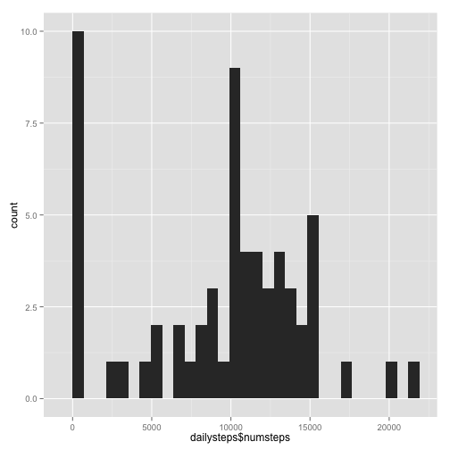
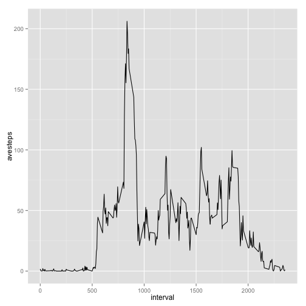
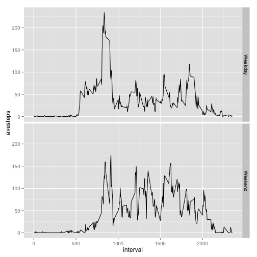

## Loading and preprocessing the data


```r
library(dplyr)
data = read.csv(unz("activity.zip", "activity.csv"), colClasses = c("integer", "Date", "integer"))
```

## What is mean total number of steps taken per day?


```r
dailysteps = summarize(group_by(data,date), numsteps = sum(steps,na.rm = TRUE))
hist(dailysteps$numsteps)
```

 

```r
mean(dailysteps$numsteps)
```

```
## [1] 9354.23
```

```r
median(dailysteps$numsteps)
```

```
## [1] 10395
```

## What is the average daily activity pattern?


```r
intervalsteps = summarize(group_by(data,interval), avesteps = mean(steps,na.rm = TRUE))
qplot(interval,avesteps, data = intervalsteps, geom = "path")
```

 

```r
intervalsteps$interval[max(intervalsteps$avesteps)==intervalsteps$avesteps]
```

```
## [1] 835
```

## Imputing missing values

There are:

```r
sum(is.na(data$steps))
```

```
## [1] 2304
```
intervals with missing values.


```r
data_imp = data %>% 
    group_by(date) %>% 
    mutate(imputesteps = mean(steps ,na.rm = TRUE))

data_imp$steps[is.na(data_imp$steps)] = data_imp$imputesteps[is.na(data_imp$steps)]
data_imp = select(data_imp,-imputesteps)

dailysteps_imp = summarize(group_by(data_imp,date), numsteps = sum(steps,na.rm = TRUE))
hist(dailysteps_imp$numsteps)
```

 

```r
mean(dailysteps_imp$numsteps)
```

```
## [1] 9354.23
```

```r
median(dailysteps_imp$numsteps)
```

```
## [1] 10395
```

## Are there differences in activity patterns between weekdays and weekends?

```r
data_imp$weekday = weekdays(data_imp$date)
data_imp$weekend = "Weekday"
data_imp$weekend[data_imp$weekday == "Saturday" | data_imp$weekday == "Sunday"] = "Weekend"
data_imp$weekend = as.factor(data_imp$weekend)

intervalsteps = summarize(group_by(data_imp,interval,weekend), avesteps = mean(steps,na.rm = TRUE))
qplot(interval,avesteps, data = intervalsteps, facets = weekend ~ ., geom = "path")
```

 
